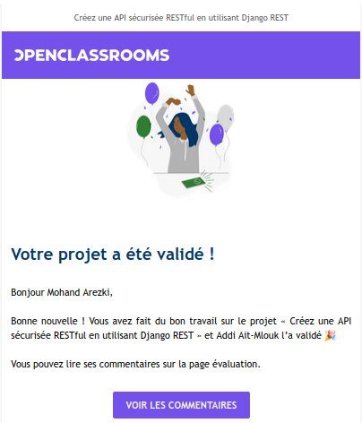

<h3 align="center">
    
    <br>
</h3>

# OpenClassrooms - Formation Développeur d'application Python - 
## Projet 10 - Créez une API sécurisée RESTful en utilisant Django REST

## Table des matières
- [A - Présentation du projet](#a---présentation-du-projet)
- [B - Points d'accès de l'API](#b---points-daccès-de-lapi)
- [C - Obtenir le code source](#c---obtenir-le-code-source)
- [D - Environnement virtuel](#d---environnement-virtuel)
  - [1- Installer pipenv](#1--installer-pipenv)
  - [2- Créer l environnement virtuel et generation de Pipfile](#2--créer-l-environnement-virtuel-et-generation-de-pipfile)
  - [3- Activer l environnement virtuel](#3--activer-l-environnement-virtuel)
  - [4- Installer de prerequis](#4--installer-de-prerequis)
- [E - Utilisation](#e---utilisation)

## A - Présentation du projet

API-SoftDesk est une API RESTful conçue pour gérer et surveiller les problèmes techniques pour divers types de projets : back-end, front-end, iOS ou Android.

Les fonctionnalités suivantes sont à implémenter :
- Gestion des utilisateurs
- Gestion des projets
- Gestion des collaborateurs sur un projet
- Gestion des problèmes
- Gestion des commentaires

<p align="right">(<a href="#top">retour en haut</a>)</p>

## B - Points d'accès de l'API
Les endpoints suivants sont implémentés pour couvrir les différentes fonctionnalités. Vous trouverez des détails dans la [documentation](https://documenter.getpostman.com/view/26516132/2s9YR3bFPF).

### Gestion des utilisateurs

| Endpoint                                       | Méthode HTTP | URL                                     |
|----------------------------------------------------|--------------|-----------------------------------------|
| Inscription de l'utilisateur                        | POST         | {{base_url}}/register/                |
| Connexion de l'utilisateur                         | POST         | {{base_url}}/login/                   |
| Affichage du profil de l'utilisateur connecté     | GET          | {{base_url}}/user/profile/            |
| Mise à jour du profil de l'utilisateur connecté   | PATCH        | {{base_url}}/user/profile/update/     |
| Suppression du compte de l'utilisateur connecté    | DELETE       | {{base_url}}/user/profile/delete/     |
| Se déconnecter                                     | POST         | {{base_url}}/logout/                 |

### Gestion des projets

| Endpoint                                      | Méthode HTTP | URL                                     |
|----------------------------------------------------|--------------|-----------------------------------------|
| Création d'un projet                               | POST         | {{base_url}}/projects/               |
| Liste de tous les projets rattachés à l'utilisateur connecté | GET  | {{base_url}}/projects/       |
| Récupération des détails d'un projet via son ID    | GET          | {{base_url}}/projects/{{id}}/       |
| Mise à jour d'un projet                            | PATCH        | {{base_url}}/projects/{{id}}/       |
| Suppression d'un projet et de toutes les ressources qui lui sont rattachées | DELETE | {{base_url}}/projects/{{id}}/ |

### Gestion des collaborateurs sur un projet

| Endpoint                                       | Méthode HTTP | URL                                     |
|----------------------------------------------------|--------------|-----------------------------------------|
| Liste de tous les utilisateurs rattachés à un projet | GET  | {{base_url}}/projects/{{project_id}}/contributors/ |
| Ajout d'un collaborateur à un projet               | POST         | {{base_url}}/projects/{{project_id}}/contributors/ |
| Suppression d'un collaborateur d'un projet          | PATCH        | {{base_url}}/projects/{{project_id}}/contributors/{{id}}/ |

### Gestion des problèmes

| Endpoint                                    | Méthode HTTP | URL                                     |
|----------------------------------------------------|--------------|-----------------------------------------|
| Création de tâches et de problèmes                  | POST         | {{base_url}}/projects/{{project_id}}/issues/ |
| Liste des problèmes liés à un projet               | GET          | {{base_url}}/projects/{{project_id}}/issues/ |
| Détails d'un problème via son ID                   | GET          | {{base_url}}/projects/{{project_id}}/issues/{{id}}/ |
| Création d'un problème dans un projet               | POST         | {{base_url}}/projects/{{project_id}}/issues/ |
| Mise à jour d'un problème dans un projet           | PATCH        | {{base_url}}/projects/{{project_id}}/issues/{{id}}/ |
| Suppression d'un problème d'un projet              | DELETE       | {{base_url}}/projects/{{project_id}}/issues/{{id}}/ |

### Gestion des commentaires

| Endpoint                                      | Méthode HTTP | URL                                     |
|----------------------------------------------------|--------------|-----------------------------------------|
| Création de commentaires                           | POST         | {{base_url}}/projects/{{project_id}}/issues/{{issue_id}}/comments/ |
| Liste de tous les commentaires liés à un problème  | GET          | {{base_url}}/projects/{{project_id}}/issues/{{issue_id}}/comments/ |
| Modification d'un commentaire                      | PATCH        | {{base_url}}/projects/{{project_id}}/issues/{{issue_id}}/comments/{{id}}/ |
| Suppression d'un commentaire                        | DELETE       | {{base_url}}/projects/{{project_id}}/issues/{{issue_id}}/comments/{{id}}/ |
| Récupération d'un commentaire via son ID            | GET          | {{base_url}}/projects/{{project_id}}/issues/{{id}}/ |

<p align="right">(<a href="#top">retour en haut</a>)</p>


## C - Obtenir le code source

Vous pouvez obtenir le code source en téléchargeant ce [lien](https://github.com/MohandArezki/P10_MohandArezki_Lahlou.git) ou en clonant le référentiel avec la commande suivante:
```
git clone git@github.com:MohandArezki/P10_MohandArezki_Lahlou.git
```

<p align="right">(<a href="#top">back to top</a>)</p>

## D - Environnement virtuel

### 1- Installer pipenv
```bash
sudo apt install pipenv
```
### 2- Créer l environnement virtuel et generation de Pipfile
```bash
pipenv install
```

### 3- Activer l environnement virtuel
```bash
pipenv shell
```
### 4- Installer de prerequis 
```bash
pip install -r requirements.txt
```
<p align="right">(<a href="#top">back to top</a>)</p>

## E - Utilisation

1. Lancer la migration:
```bash
python manage.py makemigrations
```

2. appliquer les migrations:
```bash
python manage.py migrate
```

3. Lancer le serveur Django:
```bash
python manage.py runserver
```

4. Tester l API

  Il est possible de naviguer dans l'API avec la plateforme Postman en suivant ce lien 
  [lien postman](https://bold-crescent-318416.postman.co/workspace/Mohand-Arezki-lahlou~b14e8541-b3a2-4047-8854-abb85868f19e/api/7852fd98-526e-42dd-8b12-df9641ffb7fe?version=24dc75a4-16a3-427b-a808-a3fd7d7a7c99)


<p align="right">(<a href="#top">back to top</a>)</p>

### Coordonnées d'accès

| Utilisateur     | Mot de passe   |
|-----------------|----------------|
| Admin           | P@ssword123    | 
| Conrad          | P@ssword123    |
| Anatole         | P@ssword123    |
| Almira          | P@ssword123    |
| Fidel           | P@ssword123    |

<p align="right">(<a href="#top">back to top</a>)</p>

<h3 align="center">
    
    <br>
</h3>

<p align="right">(<a href="#top">back to top</a>)</p>
